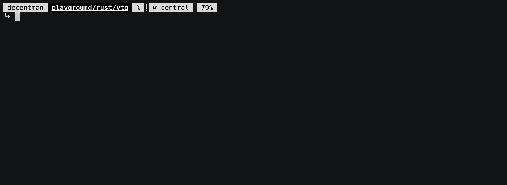

# ytq
**Y**ou**T**ube-**Q**uery.


Perform queries to youtube from the terminal.

Returns formatted output containing urls which can be used in scripts.

## Usage
```
ytq <args> <query>
```
where:
	
- **\<args\>** : Arguments to `ytq`
- **\<query\>** : Query string to send to YouTube.

e.g ```ytq how to dance```
	
> Speed varies from 0.3 seconds to 0.5 seconds ( tested using `time`)

Default behavior is to simply list the first 15-20 results from youtube's search page.

To display in special formatting, for scripting however, as of now three options are available:
- **Raw** (`-r`|`--raw`)

	Format results in a handy way to be parsed by scripts. Lists results with a handy seperator (`┊`) that is less likely to appear in output.
	
	<!-- attach a gif of raw-mode in action -->

- **First only** (`-f`|`--first`)

	Useful when you don't want to process through the entire list and only want the first result.
	
	<!-- attach a gif of first-only in action -->

- **No Title** (`-not`|`--no-title`)

	Skip printing the title.
	
	<!-- attach a gif of no-title in action -->

## Applications

<u>**Requirements**</u>:
1. a menu selector (e.g **GUI**: <u>dmenu</u>, <u>rofi</u>, <u>gmrun</u>, etc , **CLI**: <u>select</u>, <u>fzf</u>, <u>sk</u>, etc)
	> Not required if you plan to use the `first-only` mode.
2. a media player (e.g mpv, vlc, etc) 
	> **EITHER**: the media player being used needs streaming capabilities(especially the ability to stream from youtube)
	> 
	> **OR**: the video needs to be downloaded and then passed to the media player to run. 
	> A program like `youtube-dl` can be used to download the video.

<u>**Implementation**</u>:
1. **Music Player ﱘ**

	Using `dmenu` + `mpv`:
	> Demonstration in progress :)
	<!-- attach a gif of music player in action -->

2. **Video Streaming**

	Using `dmenu` + `mpv`:
	> Demonstration in progress :)
	<!-- attach a gif of video streaming in action -->

## Important

This is a simple program that fetches only the <u>first 18 results</u>
and **does not support** multipage queries at the moment.

**This program does not use the <u>Google API</u> to gather data, but rather relies on
<u>_hacky_ html/json</u> parsing to retrieve data and hence is limited in functionality and possibly prone 
to breaking if YouTube changes its response structure.**

## FAQ

> Why is it default behavior to list results in a non script friendly manner?

To verify if the internal parser is generating valid output.
So if any script breaks you can run `ytq` with the same query to check,
if it is a problem with the script or the `ytq` parser.

> Why only 15-20 results? Why not more?

Under the hood `ytq` does not use the **Google API** to get results, but rather relies on <u>html</u> that YouTube returns.
By default YouTube returns only **18** results and this is all that `ytq` can parse at the moment.

## Support
Email me @ [decentman](77405159+decent-man@users.noreply.github.com)

---
Happy querying !!!

-- decentman
